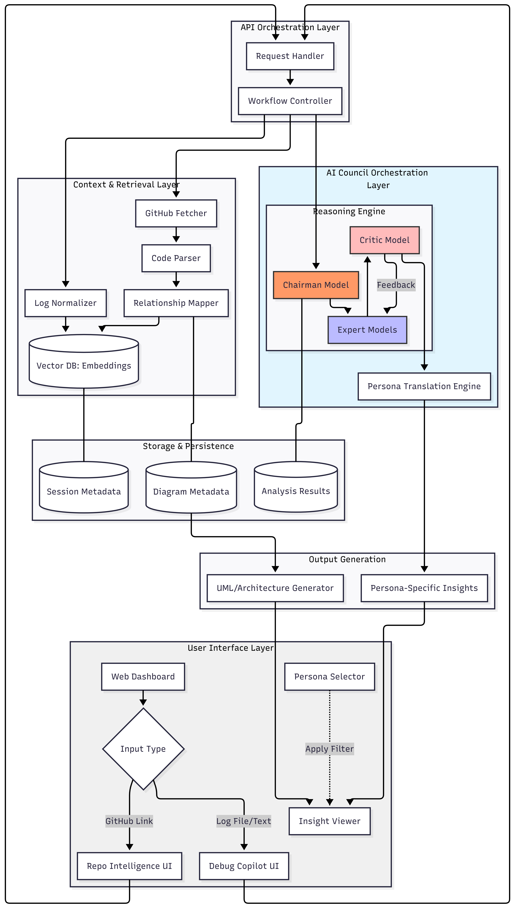
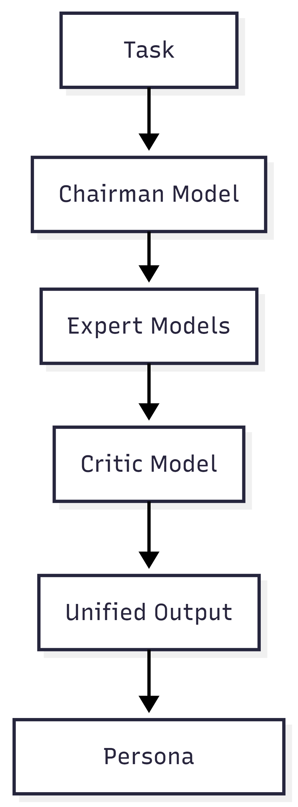
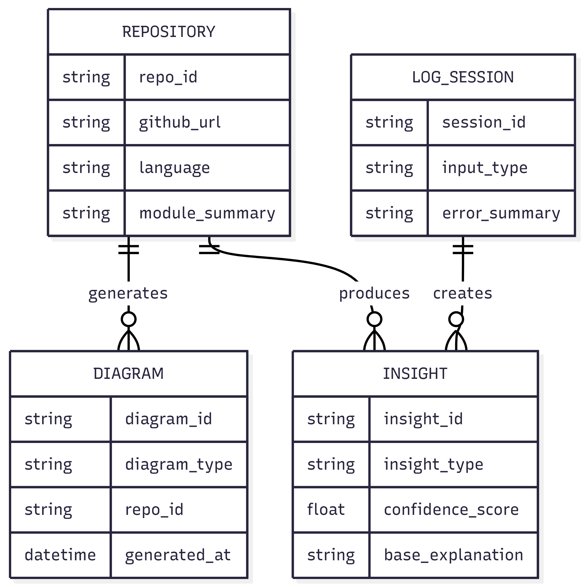
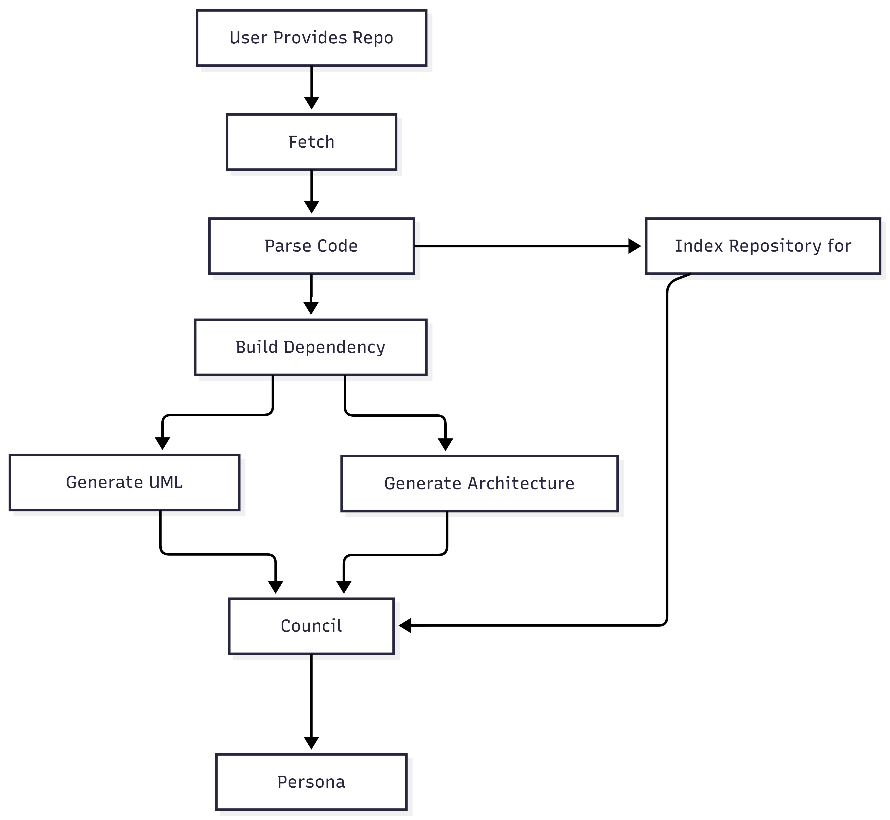
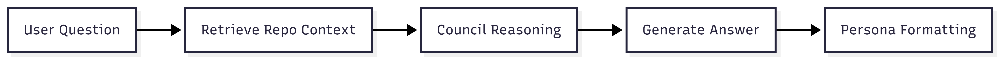

# CouncilAI Dev — MVP Design Document

---

## 1. System Overview

CouncilAI Dev is an AI-powered engineering intelligence platform designed to help software teams:

- Understand large codebases quickly  
- Debug production failures using logs and code correlation  
- Improve reliability using multi-model reasoning  
- Communicate insights to different stakeholders using persona translation  

The platform follows a layered architecture combining AI orchestration and retrieval-based reasoning.

---

## 2. High-Level Architecture

The system is divided into five major layers:

1. User Interface Layer  
2. API Orchestration Layer  
3. AI Council Orchestration Layer  
4. Context & Retrieval Layer  
5. Storage Layer  

### High-Level Architecture Diagram

---

## 3. Component Design

---

### 3.1 User Interface Layer

#### Responsibilities
- Accept repository links  
- Accept log uploads or pasted logs  
- Provide persona selection  
- Display diagrams and insights  

#### Main UI Modules
- Repository Input Module  
- Log Input Module  
- Persona Selector  
- Diagram Viewer  
- Insight Viewer  

---

### 3.2 API Orchestration Layer

#### Responsibilities
- Route repository analysis requests  
- Route debugging analysis requests  
- Manage session context  
- Trigger AI Council processing  

#### Key Design Principles
- Stateless APIs  
- Session-based processing  
- Modular routing  

---

### 3.3 AI Council Orchestration Layer

The AI Council simulates a virtual senior engineering team using multiple AI roles.

#### Roles

**Chairman Model**
- Task understanding  
- Workflow routing  

**Expert Models**
- Code reasoning  
- Debug reasoning  

**Critic Model**
- Risk validation  
- Edge case detection  

**Persona Engine**
- Explanation tone transformation  
- Audience-specific formatting  

---

### AI Council Processing Flow

---

### 3.4 Context & Retrieval Layer

#### Responsibilities
- Store embeddings for code and logs  
- Provide semantic search  
- Enable retrieval-based reasoning  

#### Components
- Code Embedding Store  
- Log Embedding Store  
- Vector Search Engine  
- Retrieval Pipeline  

---

### 3.5 Storage Layer

#### Stores
- Analysis results  
- Generated diagrams  
- Session metadata  
- Insight metadata  

---

## 4. Data Model

### Core Entities
- Repository  
- Diagram Artifact  
- Log Session  
- Insight Result  

---

### Data Relationship Diagram

---

## 5. Workflow Design

---

### 5.1 Codebase Analysis Workflow

#### Steps
1. User provides repository link  
2. Repository is fetched  
3. Code structure is parsed  
4. Dependency graph is generated  
5. UML diagrams are generated  
6. Architecture diagram is generated  
7. Repository indexed for Q&A  
8. AI Council generates explanation  
9. Persona translation applied  

---

### Codebase Analysis Workflow Diagram

---

### 5.2 Repository Q&A Workflow

#### Steps
1. User asks question  
2. Repository context retrieved  
3. AI Council performs reasoning  
4. Answer generated  
5. Persona formatting applied  

---

### Repository Q&A Workflow Diagram

---

### 5.3 Debugging Workflow

#### Steps
1. Logs uploaded or pasted  
2. Logs normalized into structured format  
3. Anomaly detection executed  
4. Code context retrieved  
5. AI Council performs root cause analysis  
6. Fix suggestions generated  
7. Persona explanation applied  

---

### Debugging Workflow Diagram

---

## 6. AI Orchestration Design

#### Processing Pipeline

Task Input → Chairman → Experts → Critic → Unified Insight → Persona Translation → Output  

#### Key Benefits
- Multi-perspective reasoning  
- Risk validation  
- Stakeholder-ready explanations  

---

## 7. Error Handling Strategy

The system handles:

- Repository access failures  
- Log parsing failures  
- Partial analysis failures  
- Model timeout retries  
- Retrieval failures  

---

## 8. Scalability Strategy

- Stateless API architecture  
- Session-based retrieval context  
- Horizontal scaling support  
- Modular council expansion  

## 9. Future Expansion (Post-MVP)

- Real-time log streaming  
- CI/CD integration  
- Multi-repository knowledge memory  
- Security audit automation  
- PR review automation  